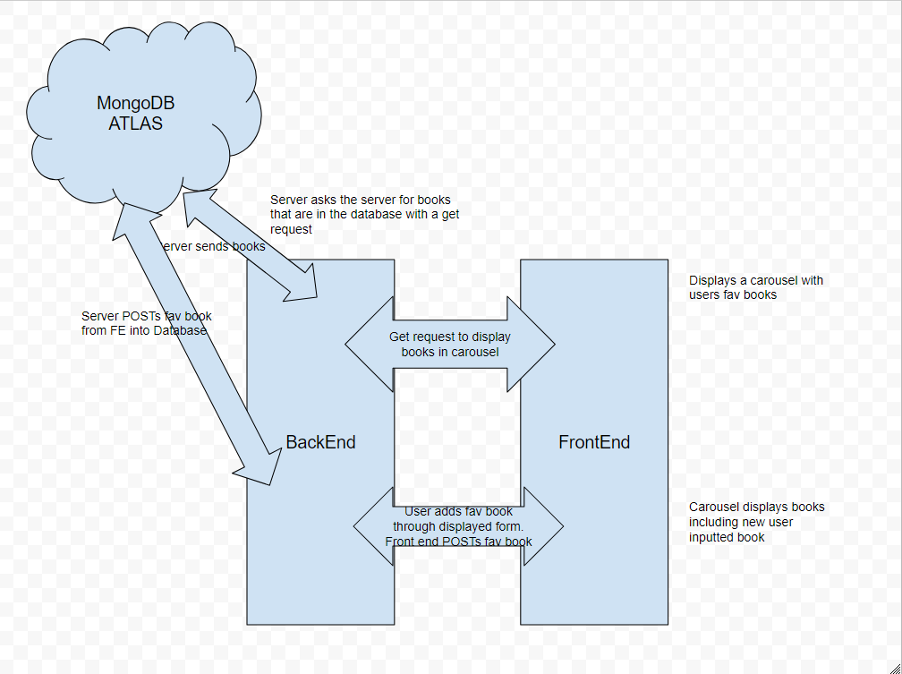

# Can of Books

**Author**: Zachary Moore and Brendan Huddleston
**Version**: 1.0.0 (increment the patch/fix version number if you make more commits past your first submission)

## Overview
A collection of the users favorite books.

## Getting Started
Clone repositorys down

## Logistical

- 0900 to 2000 CST times of communication

- Slack will be the primary form of communication along with REMO

- 10 minute break every hour

- Feature task complete for everydays lab so we dont fall behind.

## Cooperative

### Brendans Strengths

- Adaptable to rapidly changing enviroments

- Good communicator

### Zach's Strengths

- Adaptable

- Eye For Detail

In what areas do you each want to develop greater strength?

- Brendan would like to get better at speaking and writing

- Zach would like to get better at understanding how all the parts work together.

- Development will be pair programming, alternating back and forth.

## Conflict Resolution

What will your team do if one person is pulling all the weight while the other person is not contributing?

- Bring it up with the other person and work out a plan to prevent it from happening again.

What will your team do if one person is taking over the project and not letting the other member contribute?

- Mention it and ensure both partners are contributing.

How will you approach each other and the challenge of building an application knowing that it is impossible for two people to be at the exact same place in understanding and skill level?

- Coming from a place of understanding, and taking it as a teaching opportunity as well as an opportunity to help a peer.

## Architecture

## Change Log

- 11 DEC 2023 Created full stack app that renders seeded books onto page.

- 12 DEC 2023 implemented creating/deletion into app. via form that allows users to add their own books(as well as delete them) with books being stored in the DB

- 13 DEC 2023 Added a feature that allows users to update the already logged books if they need to change the information.

## Estimates

Name of feature: Lab 11 Implementing Mongo and CRUD

Estimate of time needed to complete: 5hrs

Start time: 5pm CST

Finish time: 11pm CST

Actual time needed to complete: 6hrs

Name of feature: Lab 12 Create and Delete

Estimate of time needed to complete: 5hrs

Start time: 4pm CST

Finish time: 8pm CST

Actual time needed to complete: 4hrs

## Credit and Collaborations
Brendan Huddleston, Back End Development
